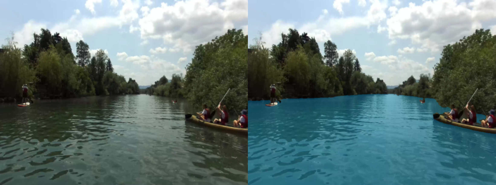

# Water Segmentation and Obstacle Detection for Unmanned Surface Vehicles

## Project Overview
This project is dedicated to improving the navigational safety and efficiency of unmanned surface vehicles (USVs) through cutting-edge image processing techniques. By leveraging a customized UNet architecture for water segmentation, and utilizing ground truth masks obtained from the Water-Obstacle Separation and Refinement (WASR) method, we achieve precise delineation of water regions from potential obstacles. In addition, the project employs the YOLO (You Only Look Once) object detection framework to accurately identify and classify obstacles within marine environments. This combination of precise water segmentation and reliable obstacle detection is essential for the autonomous operation of USVs in varied and challenging aquatic settings.

## Results
The segmentation results, as illustrated above, highlight the effectiveness of our UNet-based approach, augmented with WASR masks for ground truth, in distinguishing water from obstacles with high accuracy. This clear separation is vital for the USVs' path planning and navigation systems, enabling safer and more efficient mission execution.

## Conclusion
This project combines the strengths of a UNet-based segmentation model with WASR ground truth masks and YOLO object detection to provide a comprehensive solution for water segmentation and obstacle detection tailored for unmanned surface vehicles. The demonstrated success of these integrated approaches underscores their significance in enhancing the operational capabilities of USVs, contributing to their broader application in fields such as marine exploration, surveillance, and automated transport systems.
